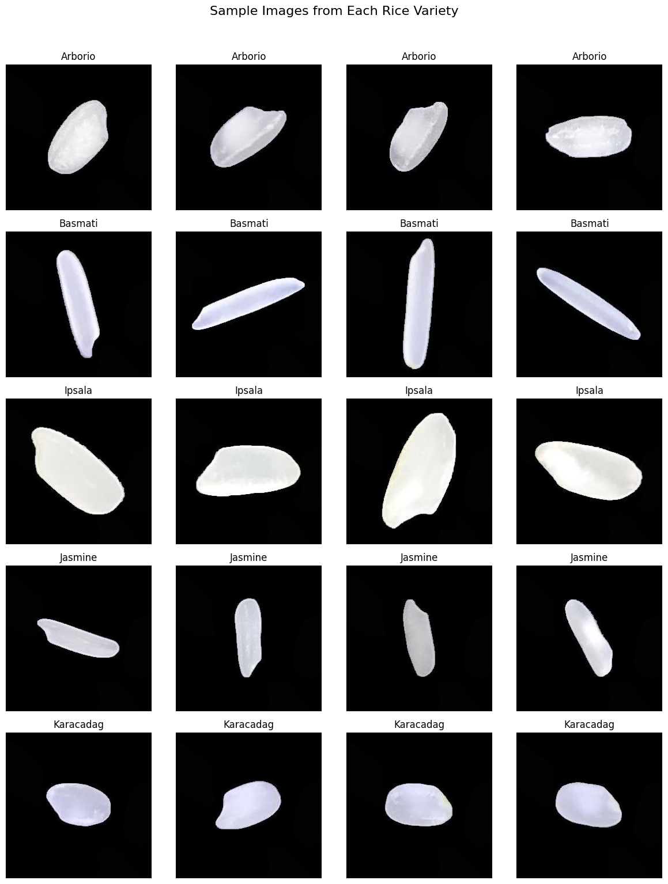
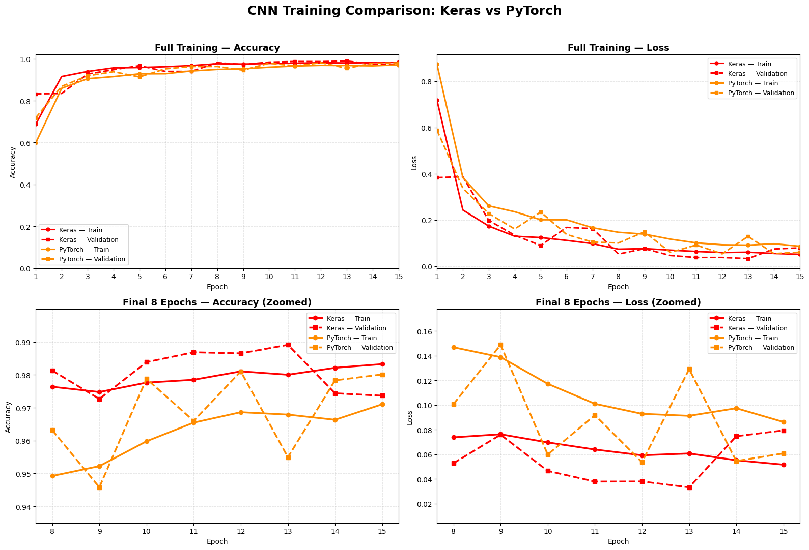

# 🍚 Rice Variety Classification – TensorFlow vs PyTorch

[](https://colab.research.google.com/github/TheTanha/rice-variety-classification/blob/main/Rice_Classification_TF_vs_PyTorch.ipynb)
[](https://www.tensorflow.org/)
[](https://www.kaggle.com/datasets/muratkokludataset/rice-image-dataset)

---

## 📊 Overview

A comprehensive deep learning project that implements a lightweight CNN to classify **5 varieties of rice** using both **TensorFlow/Keras** and **PyTorch** side‑by‑side.


## 🗂️ Dataset

| Property | Value |
|----------|-------|
| **Source** | [Rice Image Dataset](https://www.kaggle.com/datasets/muratkokludataset/rice-image-dataset) |
| **Total Images** | 75,000 |
| **Classes** | 5 (Arborio, Basmati, Ipsala, Jasmine, Karacadag) |
| **Images per Class** | 15,000 |
| **Split** | 60% Train / 20% Validation / 20% Test |
| **Image Size** | 128×128 pixels (RGB) |

> The dataset is automatically downloaded via `kagglehub` when you run the notebook.

---

## 🖼️ Sample Images from Dataset



*Random sample images from each of the 5 rice varieties in the dataset.*

---

## 🧠 Model Architecture

Both frameworks share the **exact same architecture** for a fair comparison:

```
Input (128×128×3)
       ↓
Conv2D (32, 3×3) + ReLU
       ↓
MaxPooling (2×2)
       ↓
Conv2D (64, 3×3) + ReLU
       ↓
MaxPooling (2×2)
       ↓
Conv2D (128, 3×3) + ReLU
       ↓
MaxPooling (2×2)
       ↓
Global Average Pooling
       ↓
Dense (128) + ReLU
       ↓
Dropout (0.4)
       ↓
Dense (5) + Softmax
       ↓
Output: 5 Classes
```

| Framework | Trainable Parameters |
|-----------|----------------------|
| TensorFlow/Keras | 110,405 |
| PyTorch | 110,405 |

---

## 📈 Results

### 🏆 Test Accuracy Comparison

| Framework | Test Accuracy | Best Val Accuracy | Test Loss | Training Time (sec) |
|-----------|---------------|-------------------|-----------|---------------------|
| **TensorFlow/Keras** | 97.25% | 98.91% | 0.084 | 679 |
| **PyTorch** | **98.17%** | 98.11% | **0.051** | 1,597 |

> ✅ **PyTorch achieves higher accuracy** with a similar model size.

---

### 📊 Confusion Matrix Comparison



*Confusion matrices for both TensorFlow/Keras and PyTorch models on the test set.*

---

### 📊 Classification Reports

#### TensorFlow/Keras
```
              precision    recall  f1-score   support
Arborio         0.9540    0.9747    0.9642      3000
Basmati         0.9807    0.9983    0.9894      3000
Ipsala          0.9993    1.0000    0.9997      3000
Jasmine         0.9330    0.9800    0.9559      3000
Karacadag       1.0000    0.9093    0.9525      3000

accuracy                         0.9725     15000
```

#### PyTorch
```
              precision    recall  f1-score   support
Arborio         0.9539    0.9800    0.9668      3000
Basmati         0.9940    0.9863    0.9901      3000
Ipsala          0.9980    1.0000    0.9990      3000
Jasmine         0.9820    0.9800    0.9810      3000
Karacadag       0.9816    0.9623    0.9719      3000

accuracy                         0.9817     15000
```

---

## 📁 Project Structure

```
rice-variety-classification/
├── Rice_Classification_TF_vs_PyTorch.ipynb   # Main notebook
├── README.md                                  # Project documentation
├── requirements.txt                           # Python dependencies
├── sample_images.png                          # Dataset sample images
└── model_comparison.png                       # Confusion matrix comparison
```

---

## 🚀 How to Run

### Option 1: Google Colab (Recommended)

1. Click the **"Open in Colab"** button at the top of this README.
2. Run all cells sequentially.
3. The dataset will be downloaded automatically.
4. Training takes ~30–60 minutes on a T4 GPU.

### Option 2: Local Machine

```bash
# Clone the repository
git clone https://github.com/TheTanha/rice-variety-classification.git
cd rice-variety-classification

# Install dependencies
pip install -r requirements.txt

# Launch Jupyter
jupyter notebook
```

---

## 📦 Dependencies

```txt
tensorflow>=2.12.0
torch>=2.0.0
torchvision>=0.15.0
numpy
pandas
matplotlib
seaborn
scikit-learn
opencv-python-headless
Pillow
kagglehub
```

Install all at once:

```bash
pip install -r requirements.txt
```

---

## 📝 Key Findings

1. **PyTorch achieves higher test accuracy** (98.17% vs 97.25%).
2. **PyTorch has a lower test loss** (0.051 vs 0.084).
3. **TensorFlow trains faster** (679 sec vs 1,597 sec).
4. Both frameworks have the **exact same number of parameters** (110,405).
5. **Both models perform best on Ipsala** and **struggle most with Arborio/Jasmine**.

---

## 🤝 Contributing

Contributions, issues, and feature requests are welcome!  
Feel free to check the [issues page](https://github.com/TheTanha/rice-variety-classification/issues).

---


## 👨‍💻 Author

**TheTanha**  
[](https://github.com/TheTanha)

---

## 🙏 Acknowledgements

- **Murat Koklu** for the [Rice Image Dataset](https://www.kaggle.com/datasets/muratkokludataset/rice-image-dataset).
- The open‑source community for TensorFlow, PyTorch, and the Python data science ecosystem.

---

## ⭐ Show Your Support

If you found this project helpful, please give it a ⭐ on GitHub!

[](https://github.com/TheTanha/rice-variety-classification)
```
